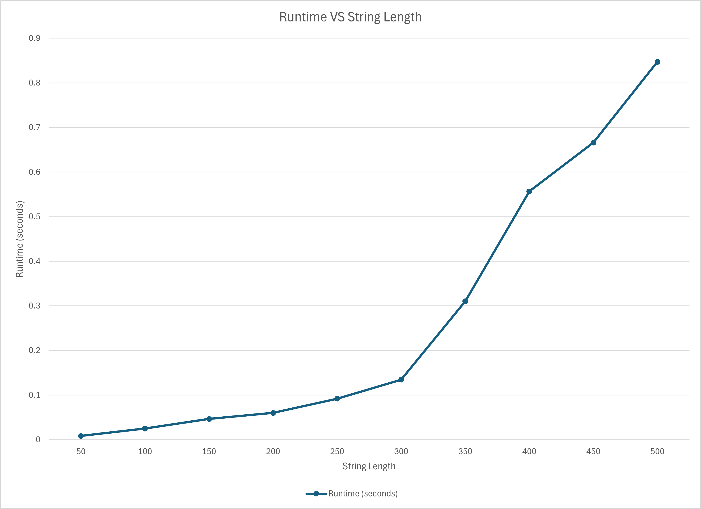

# Programming Assignment 3: Highest Value Longest Common Sequence
By: David Visbal Gomez (UFID: 11497647)

## Compile Instructions
1. Clone into a IntelliJ project.
2. Run the program in IntelliJ.

## Run Instructions
The program will prompt you to choose one of three input
choices to enter the data.  Type in the corresponding number
to the input method you wish to choose.

### 1. Manual Input
First you will have to tell the program how many characters (n)
are in the alphabet.
Afterward, you will have to input n character-integer
pairs to construct the alphabet.
Finally, you must input two different strings; the program
will take these two strings to find the highest value
longest common sequence between them.
````
3       // Alphabet size.
a 2     // Alphabet entry.
b 4     
c 5     
caab    // Strings.
aacb    
````

### 2. File Input
Provide the name of the input file in the tests directory
and hit enter.
````
example.txt  // This is the name of the file.
````

### 3. Randomly Generated Input
First you will have to tell the program how many characters (n)
are in the alphabet.  Then you will specify the upper and
lower bounds of the values in the alphabet.  Finally, you will
specify the length of the strings to get the highest value
longest common subsequence of.
````
16      // The size of the alphabet.
4       // The lower bound of the alphabet's values.
32      // The upper bound of the alphabet's values.
128     // The length of the two input strings.
````
After choosing any of the three options, the program will
output the following.
1. Every character in the alphabet and their corresponding value.
2. The two input strings.
3. The value of the optimal subsequence.
4. The optimal subsequence.
5. The time it took in seconds to compute the optimal subsequence.

## Assumptions
This program assumes every file you're reading in is
inside the "tests" directory.  If the input file is not
in that directory, the program cannot find it.

## Written Response

### Question 1: Empirical Comparison
This graph represents the increase of runtime with
respect to string length.  All input files used for
this graph were generated randomly with an alphabet size
of 10 and a number range between 10 and 50.


### Question 2: Recurrence Equation
OPT(s1, s2) is the highest value of the longest common
subsequence between two strings.

val(s) returns the value associated with the sum of
every character in string s.

Case 1: Either string is empty.
- Return 0.

Case 2: s1 and s2 are equal.
- Return Val(s1).

Case 3: s1 and s2 evict letter i and j.
- Remove letter i from s1.
- Remove letter j from s2.
- Recurse on the new substrings.

Case 4: s1 and s2 keep letter i and j.
- Recurse on the same strings but consider a different pair of letters. 

$$
OPT(s1, s2) = \begin{cases}
0 & \text{if } s1 = \emptyset | s2 = \emptyset\\
val(s1) & \text{if } s1 = s2 \\
_{0 \leq i \leq n, 0 \leq j \leq m}max\{OPT(s1 - i, s2 - j)\} & \text{else}
\end{cases}
$$

### Question 3: Big-Oh
Placeholder.
